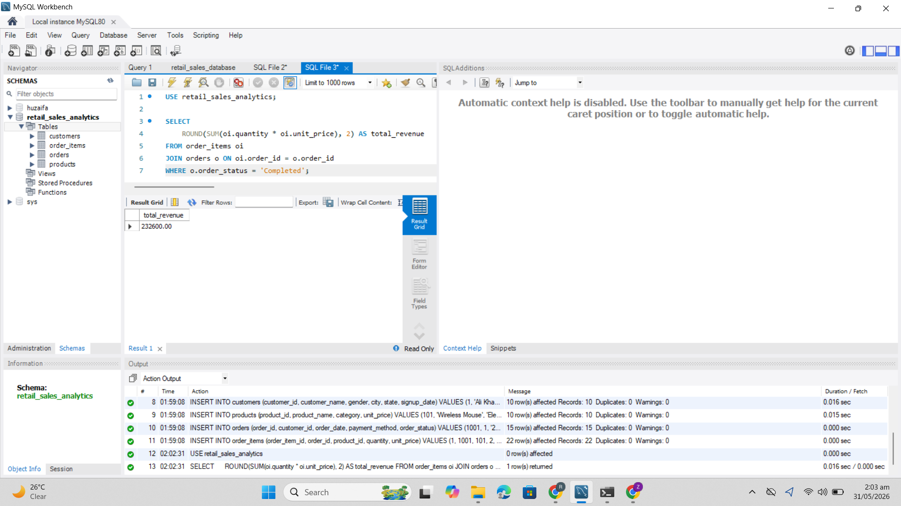
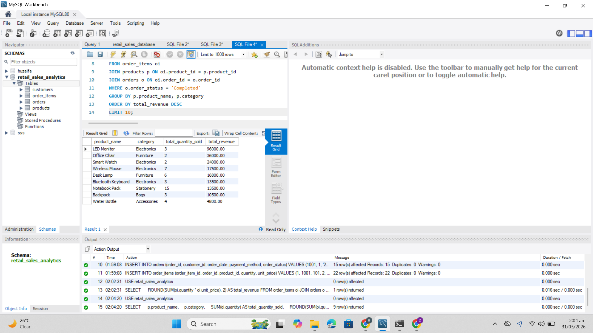
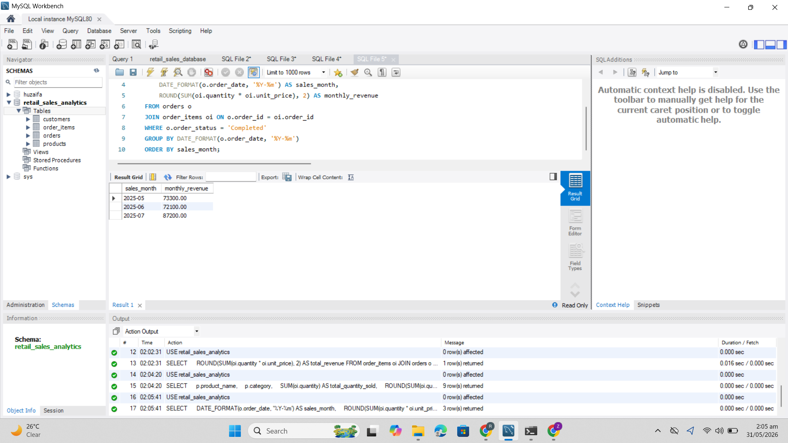
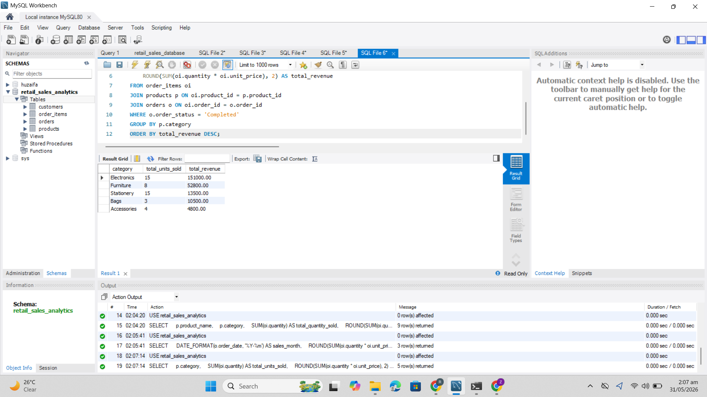
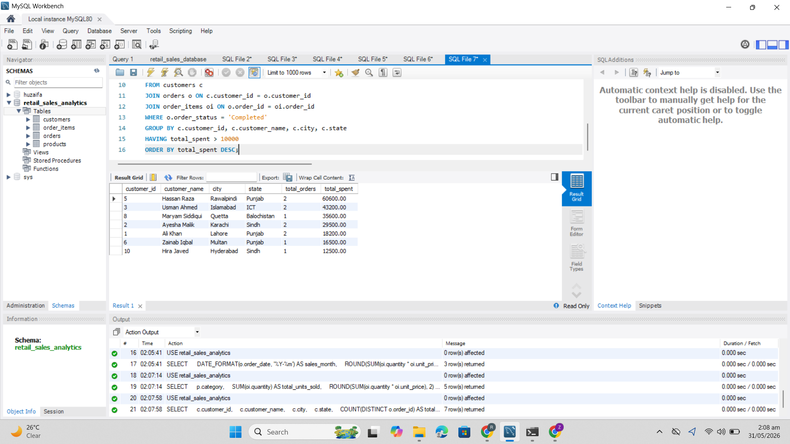
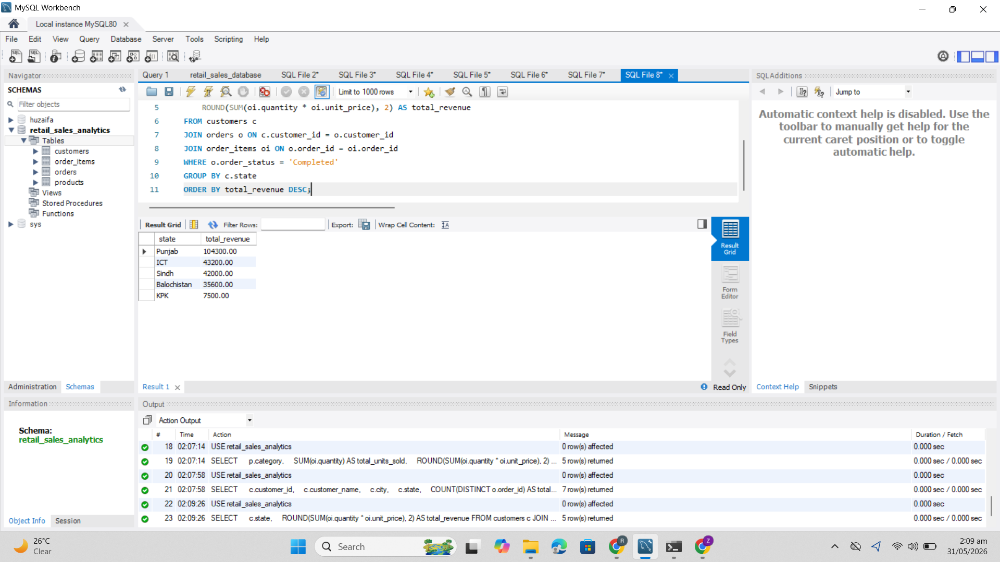
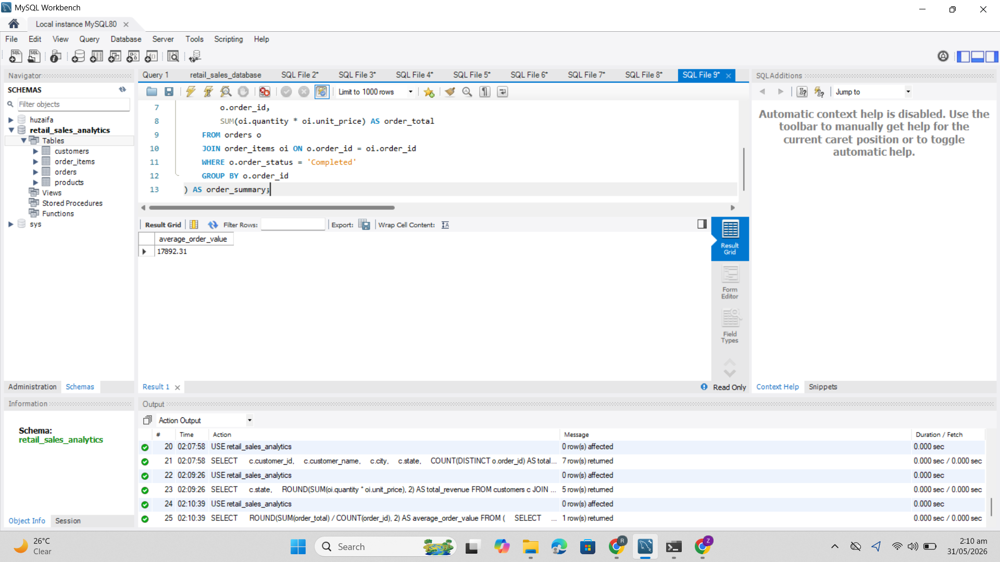
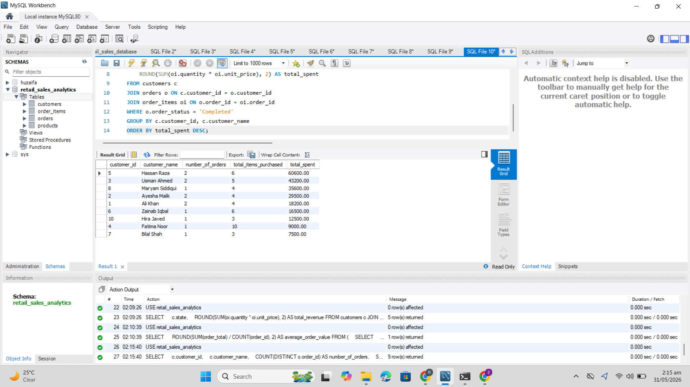
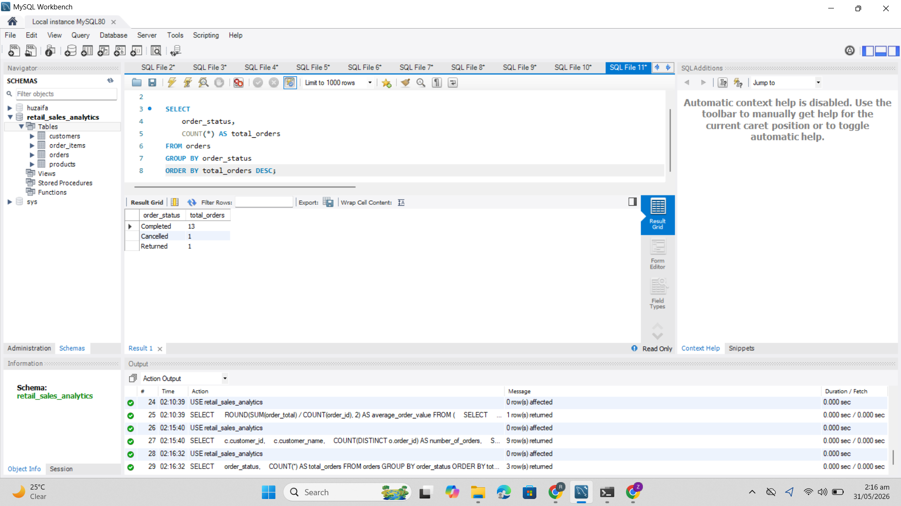

# Retail Sales Analytics Project - MySQL

## Project Overview
This project is a MySQL-based retail sales analytics project designed to analyze sales data, customer purchasing behavior, product performance, monthly revenue trends, and business insights.

The project uses a relational database structure with customers, products, orders, and order items tables to demonstrate SQL analysis and database management skills.

## Tools Used
- MySQL
- MySQL Workbench
- SQL
- Relational Database Design
- Data Analysis

## Database Structure

The database contains four main tables:

- customers
- products
- orders
- order_items

## Business Questions Answered

This project answers the following business questions:

- What is the total revenue?
- Which products generated the highest revenue?
- What are the monthly sales trends?
- Which product categories performed best?
- Who are the high-value customers?
- Which states generated the most revenue?
- What is the average order value?
- What is the customer purchase behavior?
- How many orders were completed, cancelled, or returned?

## Key SQL Concepts Used
- JOIN
- GROUP BY
- HAVING
- ORDER BY
- Aggregate functions
- Subqueries
- Date formatting
- Indexing

## Query Results

### Total Revenue

### Top-Selling Products

### Monthly Sales Trend

### Best-Performing Categories

### High-Value Customers

### Revenue by State

### Average Order Value

### Customer Purchase Behavior

### Order Status Summary

## Insights

- Electronics generated the highest revenue among all categories.
- LED Monitor was the top revenue-generating product.
- Punjab generated the highest revenue by state.
- Hassan Raza was the highest-value customer.
- Most orders were completed successfully.
- Monthly revenue increased from May to July 2025.

## Skills Demonstrated
- Database design
- SQL query writing
- Retail sales analysis
- Customer behavior analysis
- Revenue analysis
- Data cleaning and validation
- Business insight generation
- Query optimization using indexes

## About This Project
This project was created as part of my Data Analyst portfolio to demonstrate my ability to design relational databases, write SQL queries, analyze business data, and generate actionable insights.
